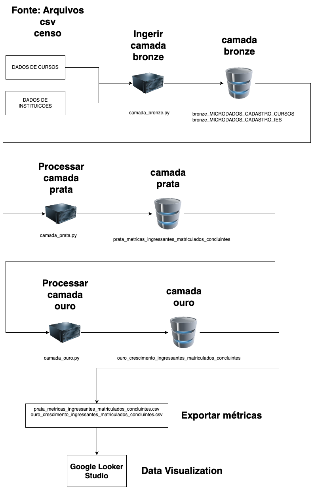

# Objetivo

Este projeto tem o objetivo de fornecer um processo de Extração, Transformação e Visualização de dados referentes aos cursos, instituições de ensino e taxa selic.

# Escopo do projeto

| Status | Descricao                                                                                                                          |
|--------|------------------------------------------------------------------------------------------------------------------------------------|
| ➡️     | Gerar arquitetura para a gestão de estudantes de uma Instituição de Ensino Superior                                                |
| ➡️     | Levantar dados relevantes para a área da Educação Superior                                                                         |
| ➡️     | Verificar se os dados disponíveis são capazes de responder questões sobre crescimento de ingressantes, matriculados e concluintes. |
| ❌     | Listar fontes e referências que sustentam a solução de dados.                                                                      |
| ✅     | Escolher um gerenciador de banco de dados adequado para o projeto;                                                                 |                                                                 
|✅| Verificar as informações sobre os metadados e efetuar a carga dos dados                                                            |
|✅| Verificar se é possível gerar os indicadores de ingressantes, matriculados e concluintes                                           |
|❌| Gerar estatísticas descritivas sobre o conjunto de dados carregado (carga).                                                        |
|✅| Criar uma camada refinada com os dados que serão analisados.|
|❌| Adicionar levantamento de Market Share nas métricas.|

# Como executar este projeto

## Premissas

- Ferramenta DOCKER instalada na máquina.
 
## Passos

1. Atualizar o arquivo "configuracoes.env" informando os seguintes parametros:
    - MYSQL_HOST: Hostname do seu banco de dados MySQL (Geralmente *localhost*)
    - MYSQL_USER: Nome de usuário com permissão de criação de databases, tabelas e manipulação de registros.
    - MYSQL_PASS: Senha do usuário.
    - MYSQL_PORT: Porta utilizada para conexão com o MySQL (Geralmente *3306*)
    - MYSQL_DB: Nome do database que comportará as tabelas deste projeto (Recomendadmos *arquitetura_big_data*)
2. Executar o comando docker-compose up para subir o container do MySQL (se necessário).
3. Executar em sequencia os arquintes arquivos
   - **camada_bronze.py** - Popula as tabelas referentes aos dados brutos
   - **camada_prata.py** - Popula a tabela de métricas de ingressantes, matriculados e concluintes por instituicao e ano.
   - **camada_ouro.py** - Popula a tabela de métricas de crescimento por instituicao de ensino e ano.

# Arquitetura

# Fontes de dados

Os dados utilizados nesta solução são de origem do Governo Federal

Dados do INEP – Instituto Nacional de Estudos e Pesquisas Educacionais
Anísio Teixeira. São recuperados dados de cursos e instituições de ensino superior. Os dados estão disponíveis para download através do link
https://www.gov.br/inep/pt-br/acesso-a-informacao/dados-abertos/microdados/censo
-da-educacao-superior.

Dados do Banco Central do Brasil. São recuperados dados de Taxa Selic. O dado está disponível para download através do link https://dadosabertos.bcb.gov.br/dataset/11-taxa-de-juros---selic

# Fluxo de dados

Temos 3 camadas dentro da nossa estrutura de processamento de dados.

**Camada Bronze** – Responsável por armazenar o dado bruto. O dado é
armazenado no banco de dados MySQL da maneira o mais fiel possível à sua
origem. As tabelas desta camada estão listadas abaixo e são populadas através do
script *camada_bronze.py*.
- bronze_MICRODADOS_CADASTRO_CURSOS
- bronze_MICRODADOS_CADASTRO_IES

**Camada Prata** – Responsável por armazenar os dados de métricas de
ingressantes, matriculados e concluintes agrupados por instituição de ensino
superior. A tabela referente a esta camada está listada abaixo e seu conteúdo é gerado através do script *camada_prata.py*.
- prata_metricas_ingressantes_matriculados_concluintes

**Camada Ouro** – Responsável por armazenar os dados processados de crescimento
de ingressantes, matriculados e concluintes agrupados por instituição de ensino
superior. A tabela referente a esta camada está listada abaixo e seu conteúdo é gerado através do script *camada_ouro.py*.
- ouro_crescimento_ingressantes_matriculados_concluintes

# Ferramentas e tecnologias utilizadas:
- Python 3
    - pandas
    - numpy
    - dotenv
- Docker
- MySQL
- Google Data Studio

# Recursos humanos para operação e sustentação:
- Engenheiros de dados
- Engenheiros de sofware
- Analistas de dados
